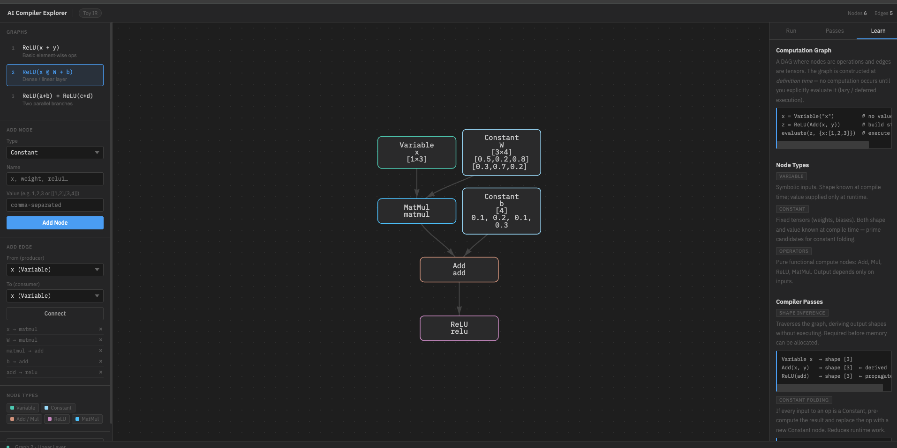

# Build AI Compiler With Me

An interactive, browser-based tool for learning how AI compilers work — built from first principles, no dependencies.

> Open `Code/ai_compiler_explorer.html` directly in any browser. No installation, no server.



---

## What is This?

Modern AI frameworks like PyTorch, TensorFlow, and JAX all sit on top of a compiler stack. Understanding that stack — computation graphs, IR passes, shape inference — is increasingly essential for ML engineers.

This project builds a **toy IR (Intermediate Representation)** in pure JavaScript/Python to make those concepts tangible and interactive. It follows the [Feynman Learning Method](https://fs.blog/feynman-learning-technique/): the best way to understand something is to build it yourself.

---

## Interactive Explorer

`Code/ai_compiler_explorer.html` is a single-file web app — open it in Chrome or Safari.

### Features

**Computation Graph Editor**
- Add nodes: `Variable`, `Constant`, `Add`, `Mul`, `ReLU`, `MatMul`
- Connect nodes with directed edges
- Click any node to inspect type, shape, and value
- Delete nodes or edges interactively

**3 Built-in Graphs**

| Graph | Expression | Concept |
|-------|-----------|---------|
| 1 | `z = ReLU(x + y)` | Basic element-wise ops |
| 2 | `y = ReLU(x @ W + b)` | Dense / linear layer |
| 3 | `z = ReLU(a+b) + ReLU(c+d)` | Parallel branches |

**Run Graph**
- Enter runtime values for `Variable` nodes
- Executes the graph in topological order
- Each node's computed value is displayed inline on the graph

**Compiler Passes**

| Pass | Type | What it does |
|------|------|-------------|
| Shape Inference | Analysis | Derives tensor shapes at compile time without executing |
| Constant Folding | Transformation | Pre-computes all-constant subgraphs, replaces with `Constant` nodes |
| Dead Code Elimination | Transformation | Removes nodes unreachable from any output |

---

## Python Implementation

The `Code/` directory also contains a Python toy compiler built without NumPy or any external libraries — pure Python only.

```
Code/
├── graph_types/
│   ├── nodes.py          # Base Node, Variable, Constant
│   ├── ops.py            # Add, ReLU operators
│   └── __init__.py
├── 01_basic_node_and_evaluator.py   # Build a graph and evaluate it
├── 02_shape_inference_pass.py       # Shape inference compiler pass
└── visualizer.py                    # Generates interactive HTML graph
```

Run the examples:

```bash
python3 Code/01_basic_node_and_evaluator.py
python3 Code/02_shape_inference_pass.py
```

---

## Core Concepts

**Lazy Evaluation** — The graph is constructed as a data structure first. No computation happens at definition time. Values are only resolved when you explicitly call `evaluate()`.

**Compiler Pass** — A function that traverses the graph and either analyzes it (read-only) or transforms it (mutates nodes/edges). Real compilers like TVM and MLIR compose dozens of passes.

**Shape Inference** — Before any tensor is allocated, the compiler walks the graph and derives the output shape of every node from its input shapes. This is required for memory planning.

**Constant Folding** — If every input to an operation is a compile-time constant, the operation can be executed once at compile time. The result replaces the subgraph as a new `Constant` node — eliminating runtime work.

**Dead Code Elimination** — Starting from output nodes, trace backward via BFS. Any node not reachable from an output contributes nothing to the result and can be removed.

---

## Roadmap

- [x] Computation graph + lazy evaluator
- [x] Shape inference pass
- [x] Constant folding pass
- [x] Dead code elimination pass
- [ ] Memory allocation planning
- [ ] Operator fusion pass
- [ ] Quantization (int8 simulation)
- [ ] Integration study: TVM / MLIR / torch.compile

---

## Industry Context

These same primitives run at scale in production systems:

- **TVM** — graph-level and loop-level optimizations for CPU/GPU/NPU
- **MLIR** — multi-level IR framework used inside LLVM, TensorFlow, and PyTorch
- **XLA** — Google's linear algebra compiler for TPUs
- **torch.compile** — Dynamo captures the graph; Inductor applies passes and generates kernel code

The concepts here are identical. Production compilers add hardware codegen, loop tiling, quantization, and distributed placement on top.

---

## Screenshot


*Graph 2 — Linear Layer: `y = ReLU(x @ W + b)`, with the Learn tab open showing inline concept explanations.*
