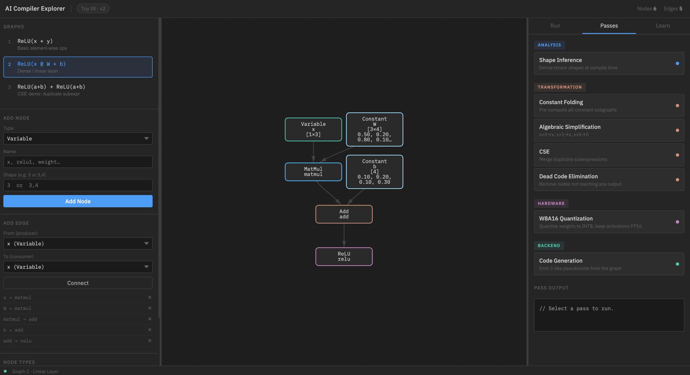

# Build AI Compiler With Me

An interactive, browser-based tool for learning how AI compilers work — built from first principles, no dependencies.

> Open `Code/ai_compiler_explorer.html` directly in any browser. No installation, no server.



*Graph 2 — Linear Layer `y = ReLU(x @ W + b)`, Passes tab open. Compiler passes are organized by category: Analysis, Transformation, Hardware, Backend.*

---

## What is This?

Modern AI frameworks like PyTorch, TensorFlow, and JAX all sit on top of a compiler stack. Understanding that stack — computation graphs, IR passes, shape inference, quantization — is increasingly essential for ML engineers.

This project builds a **toy IR (Intermediate Representation)** in pure JavaScript/Python to make those concepts tangible and interactive. It follows the [Feynman Learning Method](https://fs.blog/feynman-learning-technique/): the best way to understand something is to build it yourself.

---

## Interactive Explorer

`Code/ai_compiler_explorer.html` — single file, open directly in Chrome or Safari.

### Graph Editor

- Add nodes: `Variable`, `Constant`, `Add`, `Mul`, `ReLU`, `MatMul`
- Connect nodes with directed edges
- Drag the panel dividers to resize the left/right sidebars
- Click any node to inspect its type, shape, and value
- Delete nodes or edges at any time

### 3 Built-in Graphs

| # | Expression | What it demonstrates |
|---|-----------|----------------------|
| 1 | `z = ReLU(x + y)` | Basic element-wise ops, lazy evaluation |
| 2 | `y = ReLU(x @ W + b)` | Dense / linear layer with weight constants |
| 3 | `z = ReLU(a+b) + ReLU(a+b)` | Duplicate subexpression — CSE demo |

### Run Graph

Enter runtime values for `Variable` nodes and press **Run Graph**. The graph executes in topological order and each node's computed value is overlaid on the canvas.

### Compiler Passes

Passes are grouped by pipeline stage:

**Analysis**

| Pass | What it does |
|------|-------------|
| Shape Inference | Derives tensor shapes at compile time without executing any computation. Catches dimension mismatches early. |

**Transformation**

| Pass | What it does |
|------|-------------|
| Constant Folding | Pre-computes subgraphs whose inputs are all constants. Replaces them with a single `Constant` node. |
| Algebraic Simplification | Applies math identities: `x+0→x`, `x×1→x`, `x×0→0`. Cleans up residue left by other passes. |
| CSE | Finds nodes with identical op and inputs; merges duplicates. Load Graph 3 to see it in action. |
| Dead Code Elimination | Traces backward from outputs via BFS. Removes nodes unreachable from any output. |

**Hardware**

| Pass | What it does |
|------|-------------|
| W8A16 Quantization | Quantizes `Constant` weight tensors to INT8 with a per-tensor scale. Shows quantization error. Activations remain FP16. |

**Backend**

| Pass | What it does |
|------|-------------|
| Code Generation | Emits syntax-highlighted C-like pseudocode in topological order. W8A16-aware: shows `int8_t` storage + `dequantize()` calls. |

### Learn Tab

8 collapsible sections covering every concept with explanations and code examples:
Computation Graph · Shape Inference · Constant Folding · Algebraic Simplification · CSE · DCE · W8A16 Quantization · Code Generation · Industry Frameworks

---

## Python Implementation

Pure Python toy compiler — no NumPy, no external dependencies.

```
Code/
├── graph_types/
│   ├── nodes.py                      # Base Node, Variable, Constant
│   ├── ops.py                        # Add, ReLU operators
│   └── __init__.py
├── 01_basic_node_and_evaluator.py    # Build a graph and evaluate it
├── 02_shape_inference_pass.py        # Shape inference compiler pass
└── visualizer.py                     # Generates interactive HTML graph
```

```bash
python3 Code/01_basic_node_and_evaluator.py
python3 Code/02_shape_inference_pass.py
```

---

## Roadmap

- [x] Computation graph + lazy evaluator
- [x] Shape inference pass
- [x] Constant folding pass
- [x] Dead code elimination pass
- [x] Algebraic simplification pass
- [x] Common subexpression elimination (CSE)
- [x] W8A16 quantization simulation
- [x] Code generation backend (C pseudocode)
- [x] Resizable panel dividers
- [ ] Operator fusion pass
- [ ] Memory allocation / lifetime planning
- [ ] Loop tiling / unrolling simulation
- [ ] Integration study: TVM / MLIR / torch.compile

---

## Industry Context

Every pass in this explorer maps directly to production compilers:

| Framework | How it uses these concepts |
|-----------|---------------------------|
| **TVM** | Relay IR → graph passes → TIR → CUDA/Metal/Hexagon codegen |
| **MLIR** | Multi-dialect lowering; each dialect transformation is a pass |
| **XLA** | HLO IR with aggressive fusion for TPUs; used by JAX and TF |
| **torch.compile** | Dynamo captures graph; Inductor applies passes, emits Triton kernels |
